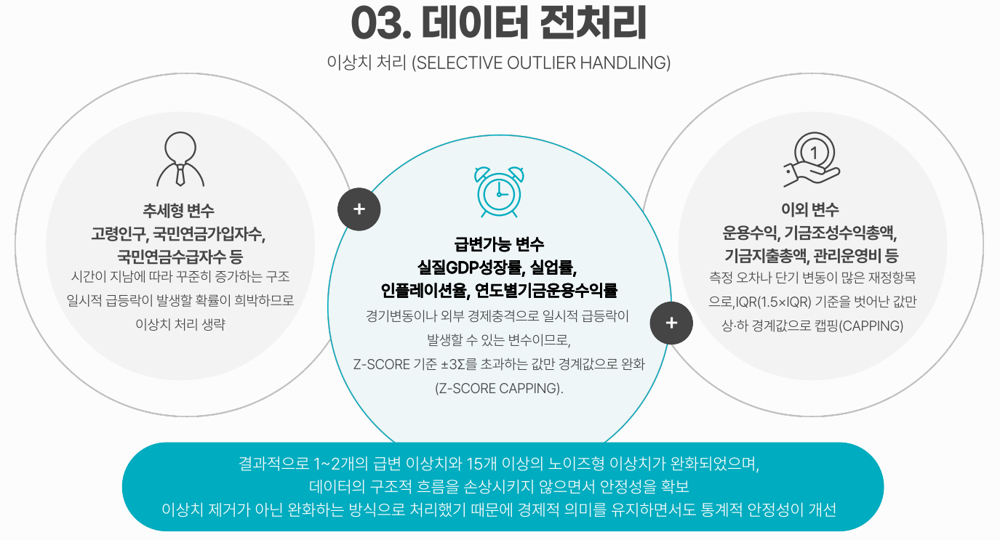
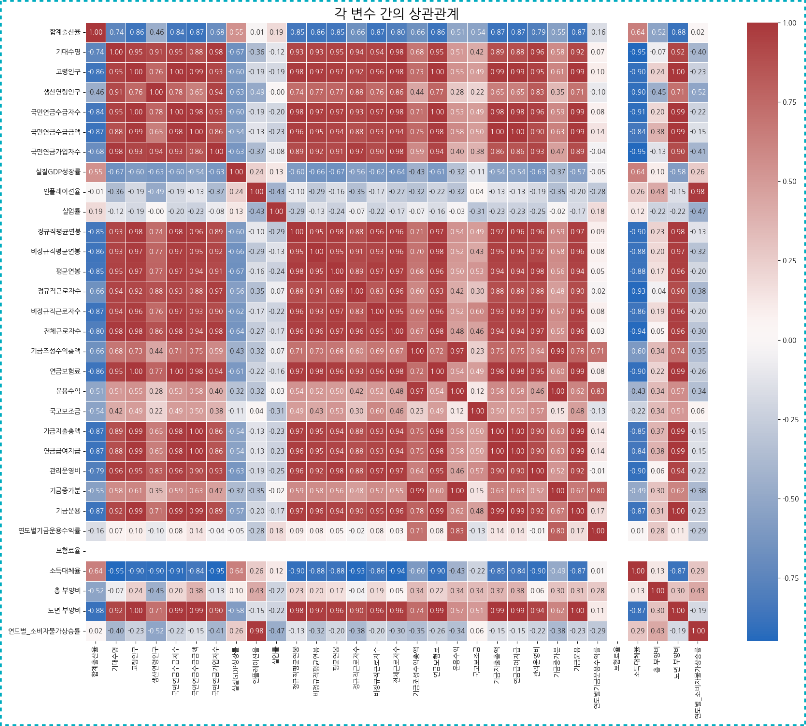
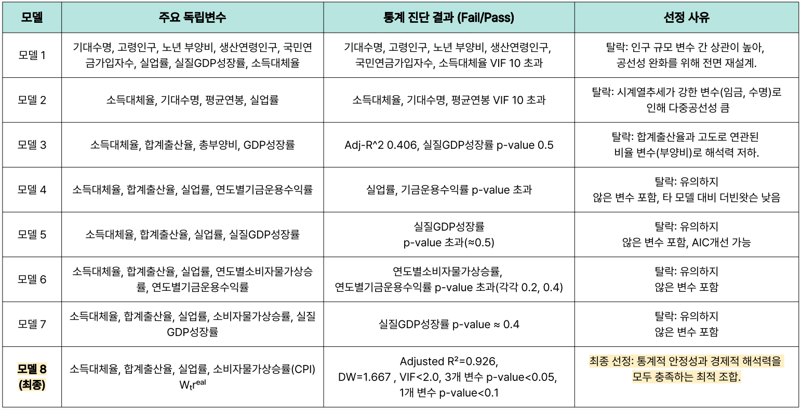
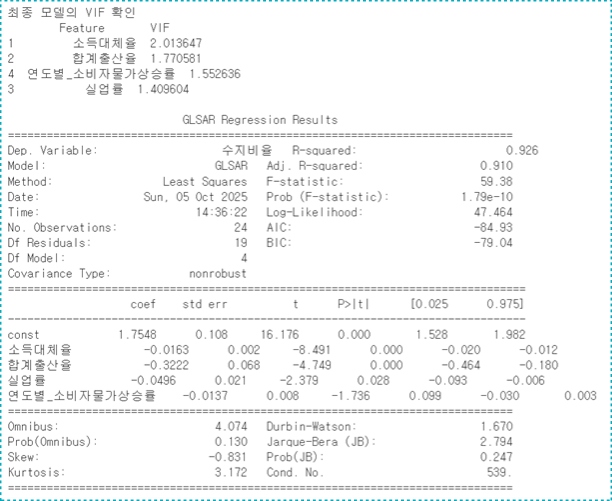
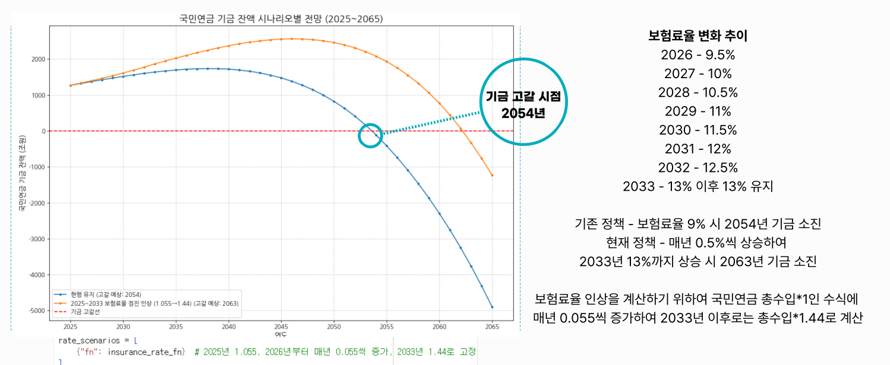
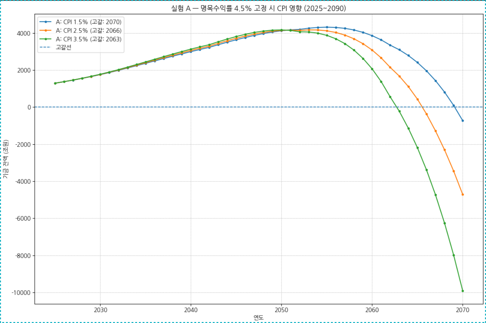
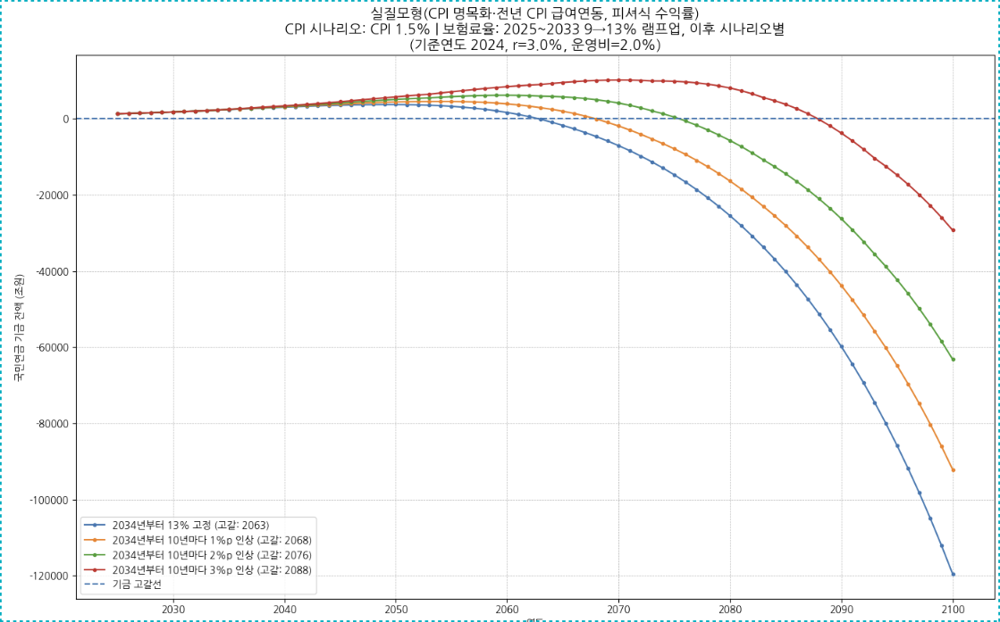
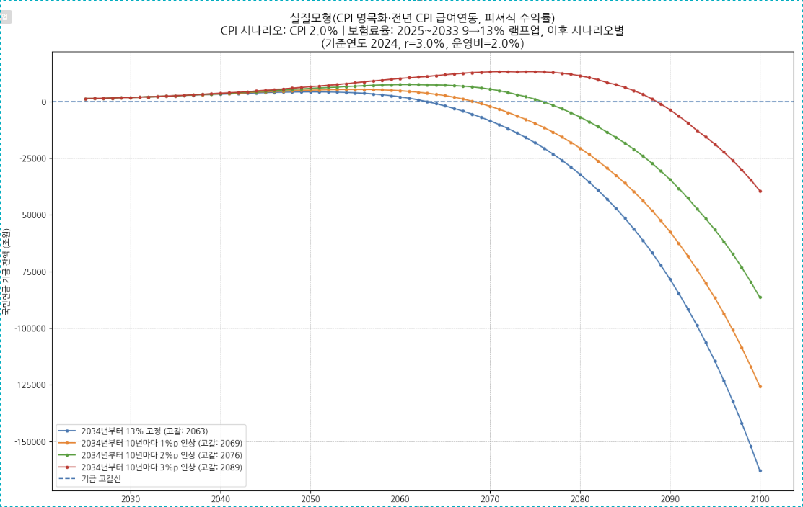
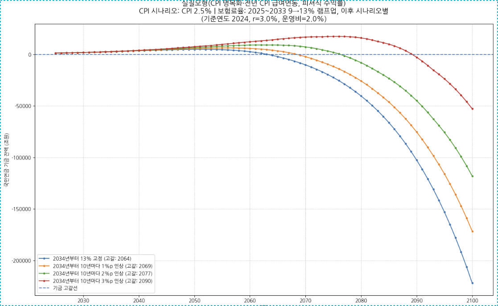

# 25 Statistics Champion Showdown
> **국민연금 기금 소진 완화 정책 수립을 위한 통계적 분석**  
> GLSAR 회귀 + 시나리오 시뮬레이션 기반 재정 지속가능성 평가  
> _2025 응용통계학과 통계최강자전 · 신통방통응통_  
> _정명훈 · 김재현 · 배지성 · 최지영 · 최은서_ &nbsp;&nbsp; **🏆 우수상 수상**

  

2025년 국민연금법 개정안(보험료율 9%→13%, 명목소득대체율 40%→43%) 시행을 앞두고, **국민연금 재정의 장기 지속가능성에 영향을 미치는 핵심 요인을 통계적으로 규명**하고 다양한 정책 시나리오 하에서 **기금 고갈 시점을 정량적으로 시뮬레이션**한 프로젝트입니다.

단순 예측이 아니라 **"어떤 변수가 재정 구조를 결정하는가 → 그 변수가 어떻게 변하면 고갈 시점이 어떻게 움직이는가"** 의 두 단계 분석을 통해 정책적 시사점을 도출했습니다.

---

## 1. 문제 정의: 왜 지금 국민연금인가

- **2025년 국민연금법 개정안** (2026.01.01 시행 예정)
  - 보험료율 인상: **9% → 13%**
  - 명목소득대체율 인상: **40% → 43%**
  - 크레딧 제도 확대 및 국가 지급보장 명문화
- **국회예산정책처 전망**: 개정 후 재정수지 적자 시점 **7년 연기 (2041 → 2048)**, 기금 소진 시점 **8년 연기 (2057 → 2065)**
- **본 연구의 질문**: "어떤 거시경제·인구 변수가 이 시점을 실제로 좌우하는가?"

## 2. 데이터 수집

2000–2024년 연도별 거시·인구·연금 지표를 통합 구축 (총 25년치, 31개 변수).

| 출처 | 변수 |
|---|---|
| 통계청 | 합계출산율, 고령인구, 생산연령인구, 실업률, 임금 등 |
| 한국은행 ECOS | 실질GDP성장률, 인플레이션율, 소비자물가상승률(CPI) |
| 국민연금공단 | 가입자 수, 수급자 수·금액, 기금 조성·지출·운용수익률, 보험료율, 소득대체율 |
| 지표누리 / E-나라지표 | 부양비, 노년부양비 등 |

## 3. 전처리: 시계열 특성을 보존하는 선택들

### 결측치 처리
- 정규직/비정규직 근로자 수 컬럼에서 각 1개 결측 발생
- **후방보간(BFILL)** 방식 채택 → 시계열 연속성을 유지하는 가장 자연스러운 방식
- 평균 대체는 추세 왜곡, `dropna()`는 손실 위험이 있어 배제
- 인접 연도 값이 유사한 국민연금 지표 특성상 보간 왜곡 가능성 거의 없음

### 이상치 처리: Selective Outlier Handling

단일 기준(IQR)으로 일괄 처리하면 **정상적인 추세형 증가조차 이상치로 잘못 인식**되는 문제가 있어, 변수를 세 그룹으로 나눠 다르게 처리했습니다.

| 변수 그룹 | 예시 | 처리 방식 | 근거 |
|---|---|---|---|
| **추세형 변수** | 고령인구, 국민연금 가입자/수급자 수 | 처리 생략 | 꾸준한 증가 구조 — 일시적 급등락 가능성 희박 |
| **급변가능 변수** | 실질GDP성장률, 실업률, 인플레이션, 기금운용수익률 | **Z-score capping (±3σ)** | 경기 변동·외부 충격으로 일시적 급등락 가능 |
| **이외 변수** | 운용수익, 기금조성·지출, 관리운영비 | **IQR capping (1.5×IQR)** | 측정 오차·단기 변동이 잦은 재정항목 |

<p align="center">
  
  <br/>
  <em>변수 성격에 따른 3그룹 차등 처리 — 추세형은 보존, 급변가능은 Z-score, 그 외는 IQR capping</em>
</p>

→ "제거가 아닌 **경계값 완화(capping)**"를 통해 데이터 손실 없이 극단값의 영향만 감소시킴.

## 4. 분석 방법론

### 4-1. 종속변수 선택: 왜 "수지비율"인가

$$\text{수지비율} = \frac{\text{연금급여지급}}{\text{연금보험료}}$$

기금 규모나 단순 적립금 증감보다 **'유입 vs 유출'의 흐름(flow)** 을 직접 보여주는 지표라서 채택. 이 비율이 높아질수록 지출이 수입을 초과해 재정 압박이 커집니다.

### 4-2. 변수 선택: 왜 자동 선택을 쓰지 않았는가

Forward / Backward / Stepwise 같은 자동 선택을 **의도적으로 배제**했습니다.

<p align="center">
  
  <br/>
  <em>전체 변수 간 상관관계 — 대부분 0.8 이상의 강한 자기상관, 다중공선성 완화 필요성 시사</em>
</p>

| 이유 | 설명 |
|---|---|
| **다중공선성** | 국민연금 변수 대부분이 동일 방향(상승 추세) → 자동 알고리즘이 "통계적 중복"으로 간주해 제도적 핵심 변수까지 제거 |
| **경제적 해석력 손실** | 단기 p-value만 보고 소득대체율 같은 핵심 변수가 배제될 위험 |
| **표본 수 제약** | N≈25로 작아 자유도 급감 → AIC·BIC 변동 폭이 커져 선택 결과가 불안정 |
| **실험 검증** | Stepwise 모델은 Adjusted R² 불안정, DW < 1.3 (자기상관 심각), 부호 반전 발생 |

→ 대안으로 **이론 기반 변수 조합 + 통계 진단**(VIF, p-value, Adj R², Durbin–Watson)을 병행하는 **수동 모델 선택** 전략을 채택. 8개 후보 모델을 비교했습니다.

| 모델 | 진단 결과 | 결론 |
|---|---|---|
| 모델 1 | 인구 변수 간 VIF > 10 | 탈락 (공선성) |
| 모델 2 | 임금·수명 변수 VIF > 10 | 탈락 |
| 모델 3 | Adj R² 0.406, GDP p=0.5 | 탈락 |
| 모델 4–7 | 일부 변수 p-value 초과 | 탈락 |
| **모델 8 (최종)** | **Adj R² 0.926, DW 1.667, VIF < 2.0** | **선정** |

<p align="center">
  
  <br/>
  <em>8개 후보 모델 통계 진단 결과 — 모델 8만이 모든 기준(VIF, p-value, Adj R², DW)을 충족</em>
</p>

**최종 변수**: 소득대체율, 합계출산율, 실업률, 소비자물가상승률(CPI)

### 4-3. 회귀 모델: 왜 GLSAR인가

| 모델 | 한계 | 본 연구 적합성 |
|---|---|---|
| OLS | 오차항 독립성 가정 → 시계열 자기상관 미반영 | ❌ |
| GLS | 자기상관 반영 가능하나 소표본에서 수렴 불안정 | ❌ |
| **GLSAR** | **AR(1) 가정 + 반복(iterative) 보정** | ✅ |

→ 소규모 시계열에 최적화된 안정적 접근법.

**GLSAR 회귀 결과**:

| 변수 | 계수 | p-value | 해석 |
|---|---|---|---|
| 소득대체율 | -0.0163 | **0.000** | 수지비율 악화 (지출↑) |
| 합계출산율 | -0.3222 | **0.000** | 수지비율 개선 (납입 기반 확대) |
| 실업률 | -0.0496 | **0.028** | 수지비율 악화 (수입↓) |
| CPI | -0.0137 | 0.099 | 한계적 유의, 장기 지출 압력 |

<p align="center">
  
  <br/>
  <em>GLSAR 최종 모델 summary — Adj R² 0.910, DW 1.667, 잔차 자기상관 거의 제거됨</em>
</p>

**모델 통계량**: Adj R² = **0.910**, Durbin–Watson = **1.667**, 평균 VIF ≤ 2.0

> p-value가 완전한 유의수준(0.05)을 넘더라도 계수 방향성과 경제 논리가 일관된다면 변수로서 의미가 유지됨. 특히 CPI는 단기 변동보다 **장기 재정 압력의 누적효과**를 설명하는 변수로서 단순 제거보다 해석적 유지가 타당하다고 판단했습니다.

## 5. 미래 예측: 회귀식 도출

2000–2024년 데이터로 2025–2100년의 핵심 변수를 외삽했습니다. 변수 특성에 따라 함수 차수를 다르게 적용:

| 변수 | 회귀식 | 차수 선택 근거 |
|---|---|---|
| 평균 연봉 | 1차 (선형) | 경제 성장·임금 상승의 일정 비율 진행 |
| 국민연금 가입자 수 | 2차 (곡선) | 고용·인구구조 변화에 따른 비선형 반응 |
| 국민연금 수급자 수 | 2차 (곡선) | 고령화 가속에 따른 비선형 증가 |
| 연금 보험료 | 2차 (곡선) | 보험료율·가입자·임금 복합 반영 |
| 연금 급여 지급 | **3차 (곡선)** | 정책·수급자·운용수익률 등 복합 변수, 변화폭이 시간이 지날수록 가속 |

## 6. 기금 고갈 시점 시뮬레이션

### 6-1. 기금 적립 모델

$$F_t = F_{t-1}(1 + i_t) + c_t W_t - (B_t + O_t)$$

| 기호 | 의미 |
|---|---|
| $F_t$ | t년 말 기금 잔액 |
| $i_t$ | 명목 기금수익률 |
| $c_t$ | 보험료율 (현재 9%, 2033년까지 연 0.5%p씩 13%로 인상) |
| $W_t$ | 보험료 부과 기준액 |
| $B_t$ | 연금 급여 총지급액 |
| $O_t$ | 관리·운영비 (급여 지급액 × 0.02) |

### 6-2. 기본 시나리오 결과

<p align="center">
  
  <br/>
  <em>현행 유지(2054년 고갈) vs 보험료율 점진 인상(2063년 고갈) — 9년 연기 효과</em>
</p>

- **현행 유지(보험료율 9%)**: **2054년** 기금 소진
- **현재 정책(2033년까지 13% 점진 인상)**: **2063년** 기금 소진 → 약 **9년 연기**

### 6-3. 실질 모델로 확장

명목 모델에 CPI 효과를 반영한 실질 모델로 재구성:

$$F_t = F_{t-1}(1+i) + c_t \underbrace{(W_t^{\text{real}} \cdot \text{CPI}_t)}_{W_t^{\text{nom}}} - (1+\alpha)\underbrace{(B_t^{\text{real}} \cdot \text{CPI}_{t-1})}_{B_t^{\text{nom}}}$$

급여는 전년도 CPI를 반영해 인상되므로 t-1 시점 CPI를 사용 → 인플레이션의 누적 효과를 정확히 포착.

### 6-4. 민감도 분석: CPI가 핵심 변수인 이유

<p align="center">
  
  <br/>
  <em>CPI 1.5% → 3.5% 변화 시 기금 고갈 시점이 2070년 → 2063년으로 약 7년 단축</em>
</p>

CPI를 단계적으로 변화시켜 시뮬레이션:

| CPI 시나리오 | 기금 고갈 시점 |
|---|---|
| 1.5% | **2070년** |
| 2.5% | 2066년 |
| 3.5% | **2063년** (▲ 7년 단축) |
| CPI 제외 모델 | 2069년 |

→ **물가상승률이 1.5% → 3.5%로 오르면 고갈 시점이 약 7년 앞당겨짐**. 회귀에서 한계적 유의성(p=0.099)을 보였던 CPI가 실제 시뮬레이션에서는 거시경제적 핵심 위험요인으로 작동한다는 점이 정량적으로 입증된 순간.

### 6-5. 종합 시나리오: 보험료율 ×CPI 매트릭스

**실험 B** (CPI 1.5% 고정, 보험료율 변동):

| 2033년 이후 보험료율 정책 | 기금 고갈 |
|---|---|
| 13% 고정 | 2063년 |
| 10년마다 +1%p | 2068년 |
| 10년마다 +2%p | 2076년 |
| 10년마다 +3%p | 2088년 |

**실험 C** (CPI 2.0%) / **실험 D** (CPI 2.5%) 도 동일 구조로 수행 → 보험료율 인상 폭이 클수록 고갈 연기 효과가 크지만, **CPI가 높아지면 그 효과가 빠르게 잠식됨**을 확인.

<p align="center">
  
  
  
  <br/>
  <em>좌: 실험 B (CPI 1.5%) / 중: 실험 C (CPI 2.0%) / 우: 실험 D (CPI 2.5%) — CPI가 높아질수록 보험료율 인상의 고갈 연기 효과가 빠르게 잠식됨</em>
</p>

## 7. 시사점 및 정책 제안

### 핵심 결론
**재정 안정화는 단기 운용수익률 개선보다 구조적 요인(급여 구조 개편 + 출산 기반 확충)에 대한 장기 대응 전략**이 결정적. 국민연금의 지속가능성은 결국 *"얼마나 많은 사람이 지속적으로 납입하며, 제도가 얼마나 효율적으로 설계되어 있는가"* 에 의해 결정된다.

### 정책 제안

1. **물가 안정 중심의 통화정책 강화** — 기준금리·유동성 흡수로 장기 인플레이션 억제, 실질 수익률 하락 완화
2. **공공요금·주거비 관리 정책** — CPI보다 낮은 단계적 가이드라인 도입, 저소득층 별도 지원
3. **재정·소득정책의 연계 조정** — 과도한 재정지출 억제, 물가·임금 상승 악순환 차단

### 한계 및 향후 과제
- **분석 기간 확대**: 1988년 제도 도입 시점까지 확장하여 장기 추세 반영
- **외생적 충격 반영**: 1997·2008 금융위기, COVID-19 더미 변수 추가
- **비선형 효과**: 보험료율·기금운용수익률의 임계점(threshold) 효과 고려
- **정책 시뮬레이션 확장**: 출산율·소득대체율 조합 시나리오 분석

---

## 🛠️ 기술 스택

`Python` · `pandas` · `numpy` · `statsmodels (GLSAR)` · `scikit-learn (StandardScaler)` · `seaborn` · `matplotlib`

## 📁 저장소 구조

```text
├── assets/                          # README 이미지
├── eda.ipynb                        # 데이터 수집·전처리·EDA·상관관계 분석
├── Statistic_Competition.ipynb      # GLSAR 회귀·미래 예측·기금 시뮬레이션
├── data.csv                         # 2000-2024 통합 데이터셋
└── _통계_최강자전__신통방통응통.pdf   # 최종 발표 자료
```
